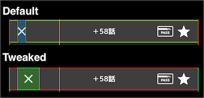

# Jump+ Tweak

A tweak to improve the usability of the Jump+ app.

## Getting Started

### Requirements

* iOS 14.0+ (Jailbroken)
* [Theos](https://github.com/theos)
* Jump+ App 3.0.23

### Installation

```sh
make package install
```

## Features

### Expands the tapable area of the close button



## Author

Watanabe Toshinori – toshinori_watanabe@tiny.blue

## License

This project is licensed under the MIT License. See the [LICENSE](LICENSE) file for details.
